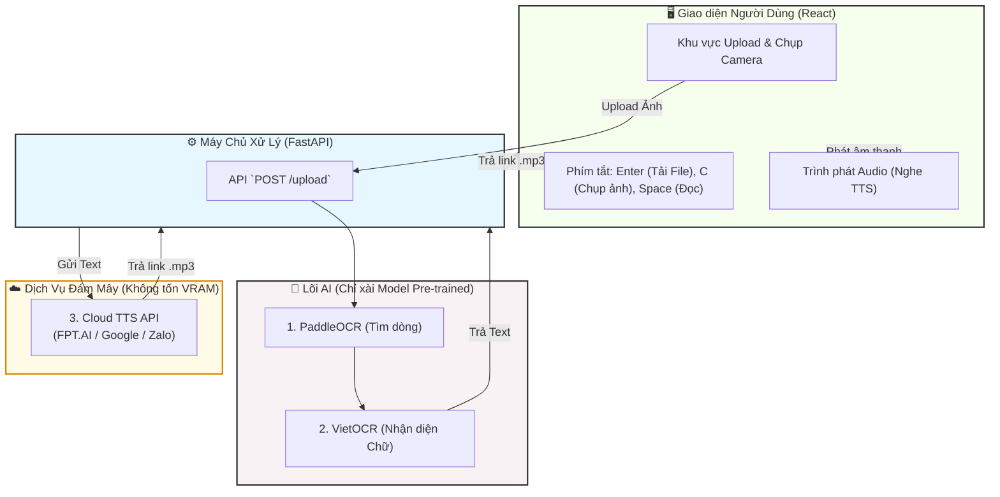
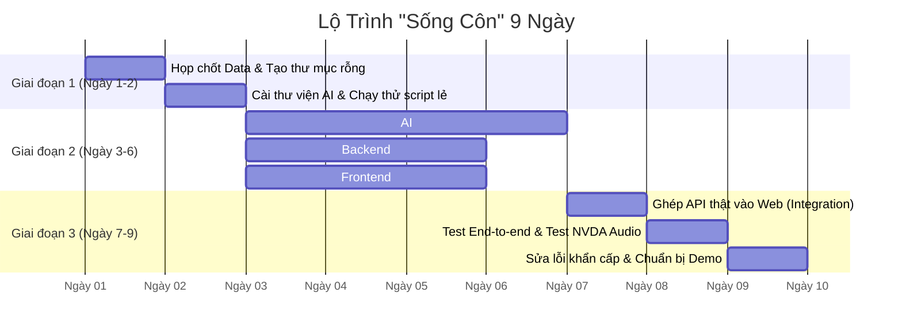

# Lộ Trình Phát Triển Nước Rút (9 Ngày) - Hệ Thống Web OCR Cho Người Khiếm Thị

## 1. Giới thiệu (Phiên bản "Hackathon" Siêu tốc)
Do thời gian chỉ có **9 ngày liên tục**, chúng ta phải **CẮT BỎ HOÀN TOÀN** những thứ cầu kỳ, không có thời gian Train model AI mới. Chìa khóa trong 9 ngày là: **Chỉ xài đồ có sẵn (Pre-trained), dùng API ngoài cho phần Giọng nói (TTS) để tiết kiệm VRAM, và 3 người phải code song song không nghỉ.**

## 2. Sơ Đồ Kiến Trúc Hệ Thống (Đã tối giản)



## 3. Lộ Trình Chạy Nước Rút 9 Ngày



## 4. Phân Công Nhiệm Vụ Siêu Chi Tiết (Checklist Hành Động)

Để đảm bảo không ai bị mơ hồ hay không biết bắt đầu từ đâu, dưới đây là Checklist công việc cụ thể đến từng "đường tơ kẽ tóc" cho 3 người:

### 🧠 Thành viên 1: AI Engineer (Làm việc hoàn toàn trên Python)
*   **Ngày 1-2 (Cài đặt & Tìm Model):**
    - Tạo thư mục `backend/weights/`.
    - Lên Github của `PaddleOCR` (bản PP-OCRv3/v4) tải model nhận diện khung chữ (Detection) về.
    - Lên Github của `VietOCR` tải model `vgg_transformer.pth` (chuẩn tiếng Việt) về.
    - Cài đặt môi trường: Mở Terminal gõ `pip install paddlepaddle torch torchvision vietocr opencv-python`.
*   **Ngày 3-4 (Code luồng nhận diện bằng OpenCV):**
    - Viết 1 file `test_ocr.py`.
    - Dùng PaddleOCR truyền ảnh vào để lấy danh sách tọa độ các hộp (Bounding Boxes) bao quanh các dòng chữ.
    - Dùng hàm `cv2.crop` (OpenCV) cắt từng dòng chữ nhỏ đó ra thành hàng chục bức ảnh con (crops).
*   **Ngày 5-6 (Lắp VietOCR & Xử lý Text):**
    - Cho vòng lặp chạy từng bức ảnh con (crops) đó qua VietOCR để nó đọc ra text tiếng Việt.
    - Dùng code Python nối các dòng chữ rời rạc đó lại thành 1 đoạn văn bản hoàn chỉnh.
    - Đóng gói toàn bộ code vào file `ocr_engine.py` với cấu trúc bắt buộc:
      ```python
      def process_image(image_path: str) -> str:
          # (Code cắt ảnh và đọc chữ của bạn ở đây)
          return "Nội dung báo chí sau khi đọc..."
      ```
    - Bàn giao hàm `process_image` này cho Thành viên 2. Bạn đã xong việc!

### ⚙️ Thành viên 2: Backend Developer (Làm việc với FastAPI)
*   **Ngày 1-2 (Dựng Server & Làm Mock API):**
    - Cài đặt thư viện: `pip install fastapi uvicorn python-multipart requests`.
    - Viết file `main.py` mở port `8000`. 
    - Tạo API "Giả mạo" để cho Frontend làm giao diện sớm:
      ```python
      @app.post("/upload")
      async def upload_file(file: UploadFile):
          # Tạm thời chưa gọi AI, trả về Data giả luôn
          return {"status": "success", "text": "Hôm nay trời đẹp", "audio_url": "link_ao.mp3"}
      ```
*   **Ngày 3-4 (Kết nối FPT.AI hoặc Google Cloud TTS):**
    - Vào trang chủ FPT.AI tạo tài khoản, lấy mã `API Key`.
    - Viết 1 hàm Python: `def text_to_speech(text: str) -> str:`.
    - Dùng thư viện `requests` gửi chuỗi text lên FPT.AI. FPT.AI sẽ trả về cho bạn 1 cái đường link `.mp3`.
*   **Ngày 5-6 (Viết logic lưu file):**
    - Viết code bắt cái file upload từ Web gửi lên, lưu tạm vào ổ cứng ở `backend/temp_images/`.
    - Viết code `os.remove(file_path)` xóa file ảnh tạm đó đi sau khi xử lý xong để máy tính không bị đầy rác.
*   **Ngày 7 (Lắp ráp hệ thống):**
    - Xóa cái chữ "Hôm nay trời đẹp" giả mạo ở Ngày 1 đi.
    - Gọi hàm của Thành viên 1: `text_that = ocr_engine.process_image(duong_dan_file_vua_luu)`.
    - Lấy text thật chuyển thành Audio: `mp3_link = text_to_speech(text_that)`.
    - Trả cái `mp3_link` đó về cho Web. Xong việc!

### 🎨 Thành viên 3: Frontend Developer (Làm việc với React / HTML JS)
*   **Ngày 1-2 (Dựng UI, Upload File & Tích hợp Camera Hẹn Giờ):**
    - Tạo input ẩn `<input type="file">` để phục vụ tải file.
    - Nghiên cứu hàm `navigator.mediaDevices.getUserMedia({ video: { facingMode: "environment" } })` để ép trình duyệt luôn mở **Camera sau** của điện thoại (tuyệt đối không mở camera selfie).
    - Bắt phím tắt **`Enter`**: Mở bảng chọn File của hệ điều hành.
    - Bắt phím tắt **`C` (Camera)**: Lập trình kịch bản:
      + Dùng Javascript phát âm thanh đọc: *"Đã bật Camera, vui lòng đưa tài liệu ra trước máy tính và giữ im trong 3 giây"*.
      + Chạy hàm `setTimeout` đếm ngược 3 giây, mỗi giây phát ra một tiếng bíp.
      + Hết 3 giây, phát âm thanh *"Tách"*, tự động cắt 1 khung hình (frame) từ Video thành bức ảnh và gửi ảnh đó lên hàm Upload Backend.
*   **Ngày 3-4 (Gắn NVDA Trình đọc màn hình):**
    - Tạo thẻ tàng hình: `<div id="status-reader" aria-live="polite"></div>`.
    - Ngay lúc file bắt đầu được đẩy lên Backend, lập tức dùng Javascript sửa nội dung thẻ div thành: *"Đang gửi tài liệu và đọc chữ, vui lòng đợi 10 giây"*. Lập tức phần mềm NVDA sẽ tự phát ra tiếng đọc câu này.
*   **Ngày 5-6 (Xử lý Audio Player & Phím tắt):**
    - Lấy API giả của Thành viên 2 làm mồi. Lấy đường link `.mp3` giả nhét vào thẻ `<audio id="player">`.
    - Bắt sự kiện bàn phím: Gõ phím `Space` -> Nếu nhạc đang phát thì Pause, nếu đang Pause thì Play.
    - Bắt phím Mũi Tên Trái/Phải -> Tua đi 5 giây / Tua lại 5 giây (`player.currentTime += 5`).
*   **Ngày 7 (Ghép nối API thật & Test nhắm mắt):**
    - Thay địa chỉ API giả bằng đường dẫn gọi thẳng vào máy của Thành viên 2 (ví dụ: `http://localhost:8000/upload`).
    - **Nghiệm thu:** Bạn hãy tắt màn hình máy tính đi, nhắm mắt lại, chỉ dùng phím Enter và Space xem có nghe được tờ báo không. Nếu nghe được là hoàn hảo! Xong việc!

## 5. Kịch Bản Trải Nghiệm Người Dùng (User Flow) Tối Ưu Nhất

Để người khiếm thị sử dụng mượt mà nhất, luồng thao tác phải được **TỰ ĐỘNG HÓA** tối đa. Hệ thống sẽ kết hợp sức mạnh của Hệ điều hành (Windows) và Trình đọc màn hình (NVDA) để hỗ trợ họ. Dưới đây là luồng hoạt động chuẩn mà Frontend cần làm:

1. **Mở Web & Chọn Phương Thức (Tải hoặc Chụp ảnh):** 
   - **Tùy chọn 1 (Tải File):** Gõ phím `Enter` để mở hộp thoại chọn file của Windows. Phần mềm NVDA sẽ tự động đọc tên các file. Khi ưng ý, bấm `Enter` để chốt.
   - **Tùy chọn 2 (Dùng Camera có Âm thanh dẫn đường):** 
      + Nếu họ đang cầm hóa đơn trên tay, họ đưa ra trước Webcam và bấm phím `C`. 
      + Hệ thống lập tức đọc: *"Đã bật Camera, vui lòng giữ im tài liệu trong 3 giây"*, sau đó đếm ngược *"bíp... bíp... bíp..."*.
      + Âm thanh này giúp họ có đủ 3 giây để tự căn chỉnh tờ giấy cho ngay ngắn. Hết 3 giây, máy kêu *"Tách!"* và tự động chụp lấy 1 bức ảnh.
2. **Xử Lý Tự Động (Auto-Submit):** Ngay khi file được chọn hoặc ảnh vừa chụp xong, hệ thống **tự động Upload** gửi về Backend mà không bắt họ phải cất công đi tìm thêm nút "Gửi" hay "Đọc" nữa.
4. **Phản Hồi Trạng Thái (Audio Feedback):** Trong lúc chờ Backend chạy AI (có thể mất 10-20 giây), Frontend tự động đẩy dòng chữ *"Hệ thống đang xử lý tài liệu, vui lòng chờ..."* vào một thẻ tàng hình `<div aria-live="polite">`. Lập tức phần mềm NVDA sẽ tự động đọc câu này lên giúp người dùng yên tâm không bị hoang mang.
5. **Phát Âm Thanh Tự Động (Auto-Play):** Khi Backend chạy xong và trả về link âm thanh `.mp3`, hệ thống **tự động phát nhạc** luôn. Đang nghe dở, nếu có điện thoại tới, họ chỉ việc gõ nhẹ phím `Space` (Phím cách) để Tạm dừng, gõ lần nữa để nghe tiếp.

> **📱 LƯU Ý SỐNG CÒN KHI DÙNG CAMERA ĐIỆN THOẠI (MOBILE WEB):**
> Nếu bạn muốn lấy điện thoại truy cập vào Web đang chạy trên Laptop để quét báo, trình duyệt điện thoại sẽ **CHẶN CAMERA** ngay lập tức vì lý do bảo mật (Điện thoại chỉ cho bật cam nếu web dùng giao thức bảo mật `https://`).
> **Cách lách luật trong 9 ngày:** Cài đặt công cụ **Ngrok** trên Laptop. Chạy lệnh `ngrok http 3000` (giả sử frontend chạy port 3000). Ngrok sẽ cấp cho bạn 1 đường link bảo mật `https://...ngrok.app`. Người khiếm thị dùng điện thoại bấm vào link đó là sẽ mở được Camera sau như bình thường!

Kịch bản này giúp người khiếm thị chỉ cần thao tác đúng **1 phím** là có thể quét và nghe đọc báo từ đầu đến cuối một cách độc lập!

## 6. Cấu Trúc Thư Mục Tối Giản Nhưng Đầy Đủ

Cấu trúc này đã được thiết kế vừa đủ cho 9 ngày, không dư thừa nhưng vẫn đảm bảo chặt chẽ và khớp 100% với Checklist ở Phần 4:

```text
Blind-OCR-System/
├── backend/                  # Thành viên 1 & 2
│   ├── main.py               # File chính chạy Server FastAPI (Thành viên 2)
│   ├── requirements.txt      # Danh sách thư viện Python cần cài
│   ├── ocr_engine.py         # Luồng AI xử lý ảnh -> Text (Thành viên 1)
│   ├── temp_images/          # Nơi lưu tạm file ảnh upload lên (Phải tự động xóa sau khi OCR xong)
│   └── weights/              # Chứa file pre-trained model (Nhớ đưa vào .gitignore)
│
├── frontend/                 # Thành viên 3
│   ├── index.html            # File gốc HTML
│   ├── package.json          # Quản lý thư viện React/Vite
│   └── src/                  
│       ├── App.jsx           # Component chính chứa giao diện Upload ẩn
│       └── api.js            # Nơi chuyên chứa các hàm gọi lên `http://localhost:8000`
│
└── README.md                 # Hướng dẫn cách chạy dự án (Rất quan trọng để chép vào Báo cáo)
```
